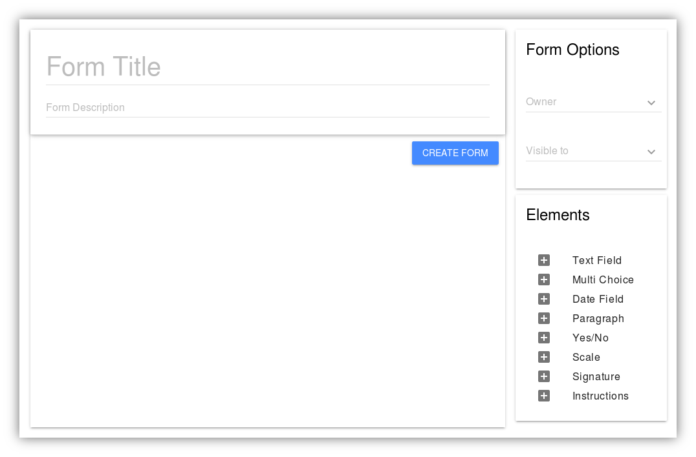

Creating Forms
==============

Creating forms with the Constellation Forms module is very easy to do.
To create a form, you must hold the
:code:`constellation_forms|form|Can add form` permission.  If you do
not yet hold this permission, ask your systems administrator to add it
to your group.  Keep in mind that you can only share form responses
with members of your own group, so if you will need a new group to be
created, now is a good time to ask your systems administrator for that
as well.

Once you have the correct permissions to create forms, click on the
:guilabel:`Create New Form` link on the Constellation main page:

After clicking the :guilabel:`Create New Form` link, the following
interface will be presented:

There are several components in this interface.  Starting at the upper
left corner, there is a card provided to set the form title and
description.  The description is displayed next to the title in the
list of available forms, it should be relatively short.  Ideally the
title and description combined are no more than 75 characters.  If
your form requires more instructions, consider using a 'Static
Instructions' widget to provide more directions on the form itself.

In the upper right hand corner the form options are shown.  The two
options here are 'Form Owner' and 'Visible to'.  These options control
the form visibility.  The Form Owner value menu will list all the
groups that you are a member of.  Any group may be made an owner of
the form and the ownership may be changed at any time.  The owning
group will be able to review form submissions and set the approved or
denied status on a form submission.  The 'Visible to' group is the
group the form will be made available to after it is created.  There
is an '<All Users>' group managed by Constellation Base which contains
all users.  All users are automatically added to this group when they
log in.

The final element of the interface is the 'Elements' card.  This card
contains all of the available form widgets.  The form widgets list has
the following widget types:

  * Text Field
  * Multi Choice
  * Date Field
  * Paragraph Field
  * Yes/No
  * Scale
  * Signature
  * Instructions

These fields are discussed in greater depth in the next section of this manual.

To create your form, you can add individual elements to the form
builder interface and configure widget options as necessary.  Here is
a detail view of the Multi Choice field with the Checkbox mode
selected:

In this image there are Title and Description fields.  These should be
relatively short, the title renders as a larger text over the field.
The description will be rendered as a sort of 'help text' of fields.
For text fields this will be in the box itself as a grayed out string
of text.  For other fields this will be rendered in small text below
the title.

Some widgets have multiple modes that can be used.  On the upper right
hand part of the image, there is a menu which lists the modes for this
widget.  This particular widget is in "Checkboxes" mode, meaning that
this widget will be rendered as checkboxes on the finished form.

Multiple choice widgets have choice options that can be added in the
widget body.  An unlimited number of options may be added, but for a
better forms experience, fewer options are easier to read and select
from.

At the lower left hand corner of the widget, there is a "Required"
slider.  If this switch is enabled, the form cannot be submitted
without this option having been completed.  On the lower right hand
corner of the widget, are two icons.  The blue trash can removes the
current widget from the form.  The vertical three dot menu shows extra
options for the widget.  For text widgets, the validation options are
shown in this menu.
