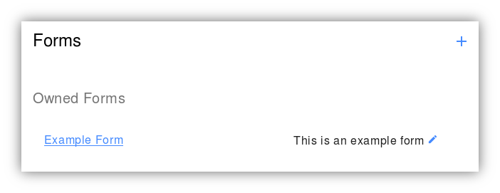
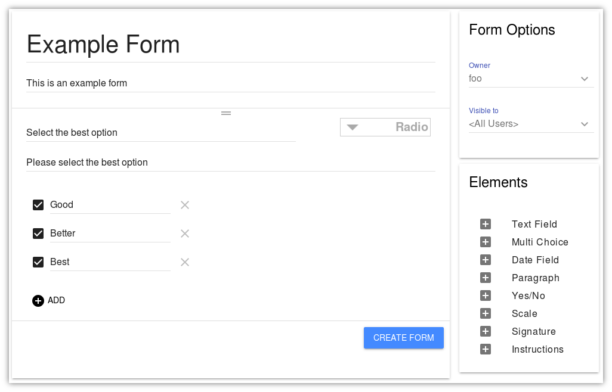

Editing Forms
=============

If you are the owner of a form, it is easy to edit it later.  Once
creating the form you can click on the pencil icon in the list to load
the form for editing.

The form will load for editing in the same interface that was used to
create it.  Once editing is complete, click on "Update Form" to save
the form.  Users that had started a form under the old version will
continue to be able to fill out that version, and new users will only
see the new form.

.. note:: If you are running an older version of the Constellation
          Forms software, the 'Update Form' button may say 'Create
          Form'.  Rest assured that in all versions of the software,
          the form will be updated, rather than a new version being
          created.
           
.. note:: If it is necessary to completely change all the fields on a
          form, consider archiving the old form and creating a new
          form from scratch.
