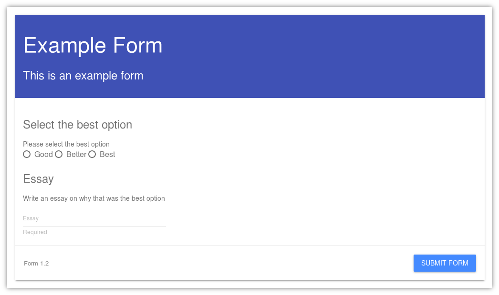

Filing a Form
=============

Filing out a form is very intuitive and follows a process similar to
other well known form platforms such as Google Forms.  To fill out a
form, select it from the list of forms available.

In list of available forms, all forms that a user has permission to
fill out will be visible.  In this example, the user only has one form
that is visible.

The form shown above is an example of a complete form as it appears
when it is being filled out.  Users can type in the boxes, and click
submit when they are ready to submit the form.

After filing out a form and submitting it, the user will be redirected
to the list of form submissions.  The pending submissions will have an
envelope icon next to them, while forms that have been reviewed will
have a thumbs up or thumbs down icon depending on their status.

