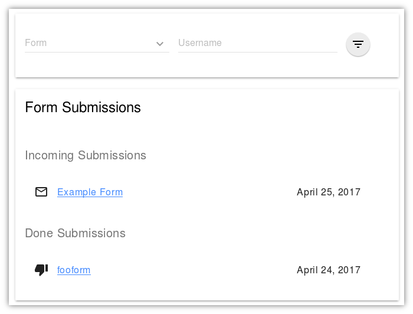
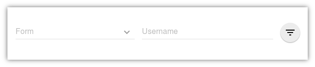
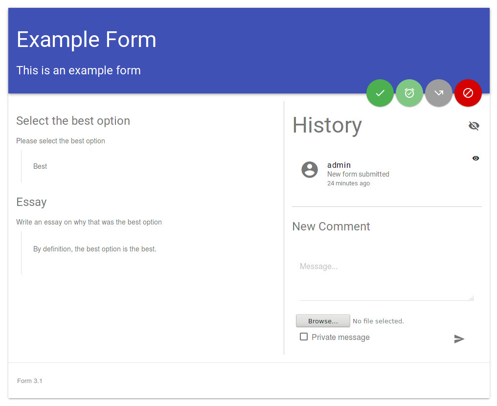
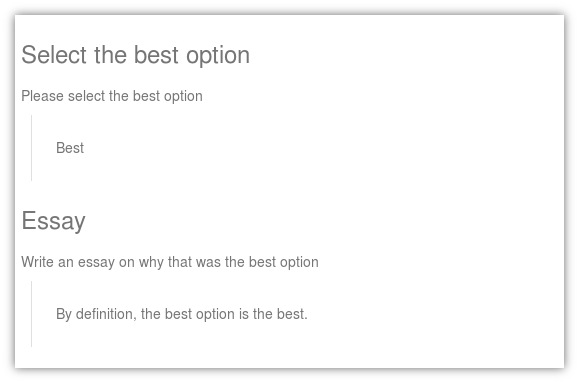
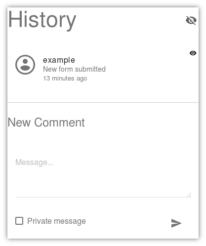
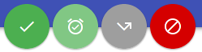

Reviewing a Form
================

Owners can see forms that they have created and review submissions for
those forms.

Forms List
----------

The listing of form submissions shows all forms that are incomming for
review by this user.  Forms can be filtered using the filter interface
at the top of the page:

The filter interface can filter by form or username.  Forms are shown
in a drop-down menu, but usernames must be typed in.  Please consult
your Systems Administrator to see if your organization has a search
interface for locating a user's username.

Form Review Interface
---------------------

The form review interface has several components, these are shown as
they appear in concert above.

Form Responses
^^^^^^^^^^^^^^

The form is shown with the responses indented below the prompts.  This
shows the user's responses with the original instructions as they
appeared to the user.

Form Log
^^^^^^^^

To the right of the form body is the log.  The form log can be used to
leave comments on the form or ask for clarification from the entity
filling out the form.  Additionally, the log shows any administrative
actions that were made on the form such as changing the form status
(e.g. approved, disapproved).

Within the log are log messages and a box to type in additional log
messages.  The checkbox below the textbox to add messages will mark a
message as private.  Private messages are visible only to other
members of the group that owns the form.  At the upper right corner of
the form is a visibility icon, clicking this icon will hide all
private comments temporarily.

Form Status
^^^^^^^^^^^

The final component of the review interface are the buttons in the
upper right hand corner.  These buttons set various statuses for the
form.  The green check mark approves the form, this is a final status
that will be communicated back to the user.  The green alarm clock
means 'tentative approval', this status does not change the ultimate
status of the form, but it will write an entry to the log showing that
on a particular date and time, the form received provisional approval.
The gray bent arrow will 'bounce' the form back to the user that
submitted it, allowing them to make changes.  This button is best used
with comments in the log that make clear the changes that are being
requested.  The final button is the red crossed circle which will mark
the form as denied.  Denied is a final status that will be
communicated back to the user that submitted the form.
