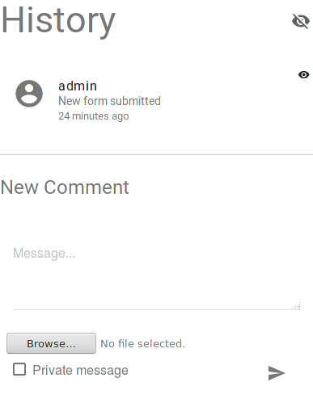

Reviewing a Form
================

Owners can see forms that they have created and review submissions for
those forms.

Forms List
----------

.. image:: img/form_submissions_list_owner.png
   :scale: 75%
   :align: center

The listing of form submissions shows all forms that are incomming for
review by this user.  Forms can be filtered using the filter interface
at the top of the page:

.. image:: img/owner_form_filter.png
   :scale: 75%
   :align: center

The filter interface can filter by form or username.  Forms are shown
in a drop-down menu, but usernames must be typed in.  Please consult
your Systems Administrator to see if your organization has a search
interface for locating a user's username.

Form Review Interface
---------------------

The form review interface has several components, these are shown as
they appear in concert above.

Form Responses
^^^^^^^^^^^^^^

The form is shown with the responses indented below the prompts.  This
shows the user's responses with the original instructions as they
appeared to the user.

.. image:: img/form_review_formbody.png
   :scale: 75%
   :align: center

Form Log
^^^^^^^^

To the right of the form body is the log.  The form log can be used to
leave comments on the form or ask for clarification from the entity
filling out the form.  Additionally, the log shows any administrative
actions that were made on the form such as changing the form status
(e.g. approved, disapproved).

Within the log are log messages and a box to type in additional log
messages.  The checkbox below the textbox to add messages will mark a
message as private.  Private messages are visible only to other
members of the group that owns the form.  At the upper right corner of
the form is a visibility icon, clicking this icon will hide all
private comments temporarily.

Form Status
^^^^^^^^^^^

.. image:: img/form_review_status.png
   :scale: 75%
   :align: center

The final component of the form review interface are the red and green
buttons at the top right of the review interface.  These buttons will
set the form's status to approved or disapproved.  Once set, the form
will no longer have the 'pending' icon next to it and it will instead
have a thumbs-up or a thumbs-down icon to denote its status.
