Widget Overview
===============

This page includes an overview of all widgets.  Widgets are individual
elements that can be added into a form.  Some widgets are configurable
and have options.  This page walks through each widget as it would
appear on a form.  In fact this page was built by generating a form
with all possible widgets on it and then clipping them out for closer
inspection.

Form Header
-----------

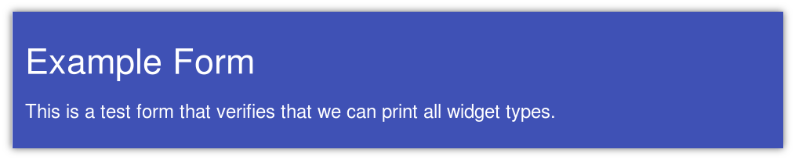

Though not technically a widget, the form header is automatically
added to every form.  This header includes in large print the title
and description for the form.  These values should be kept relatively
short in order to keep the form header clean and easy to read.

Static Instructions
-------------------

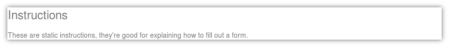

The static instructions widget can be used to provide additional
information or clarification of fields that require special
instructions.  This widget is particularly useful for explaining
prompts for essays or otherwise complex questions.

Text Field
----------

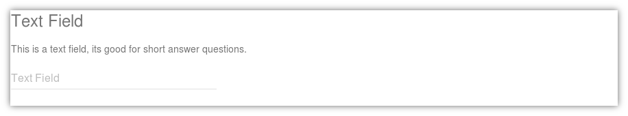

The text field is designed to take a single line of text.  It is
useful for asking questions that have very short answers.  This field
does not support multiple lines, a Paragraph Field should be used for
that instead.

Paragraph Field
---------------

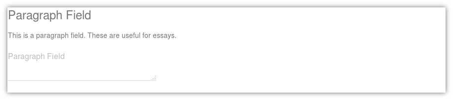

This paragraph field is useful for accepting large essays.  This field
allows a user to input as much text as needed.  The box can be resized
if needed to accommodate more text as a user types in text.  On printed
forms, this renders as a box with a note to staple additional sheets
if needed.

Yes/No Field
------------

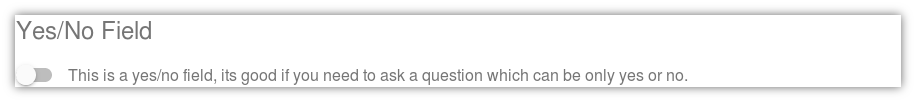

This field presents a toggle switch or checkbox, depending on the
widget mode.  This field is useful for questions where the only
possible answers to a question are yes or no.

Date Field
----------

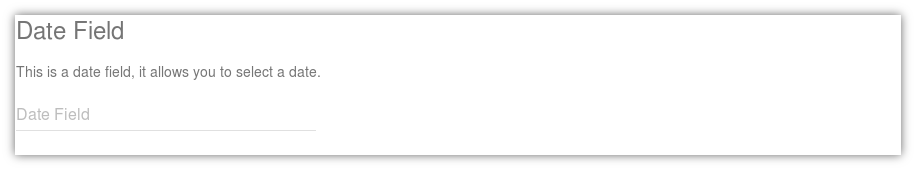

This field accepts dates and has a date picker that allows a user to
select a date from a clickable calendar.  Advanced users can type in
dates directly in the format :code:`MM/DD/YYYY`.

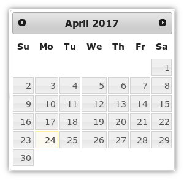

The date-picker provides an intuitive interface for users to select a
date without manually typing one in.

Scale Field
-----------

The Scale field can operate in one of two modes, the default mode of
the scale field is a row of stars which users can select.

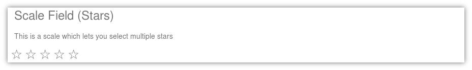

The stars will fill with color as they are selected.  This widget is
useful for asking about satisfaction.

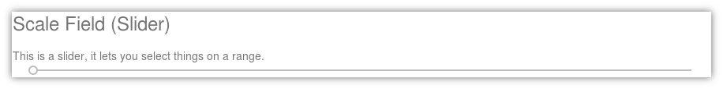

The Scale field can also appear as a slider.  The slider mode shows a
horizontal bar with a drag handle which can be dragged across.

Multi Field
-----------

The multi field has multiple modes, the default mode uses check-boxes.

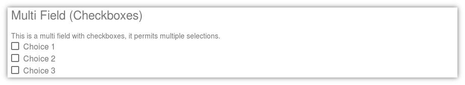

The checkbox field allows a user to select multiple options.  On paper
this will render as a row of options with boxes next to them to check
by hand.

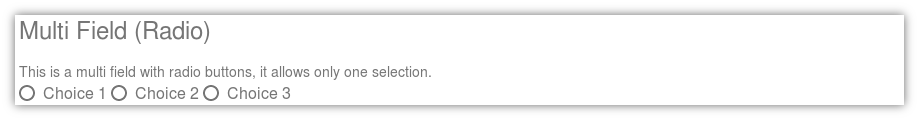

The radio button field requires a user to make a selection of one and
only one option.  Clicking on other options will unset any previous
selections, much like the buttons on a car radio.

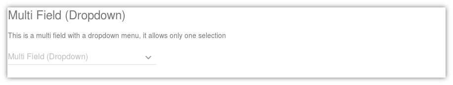

The drop down menu works the same way as the radio button choices, but
is better suited to a long number of choices since they list is not
visible until clicked on.  Choosing any option in the menu will
overwrite any previous selection.

Signature Field
---------------

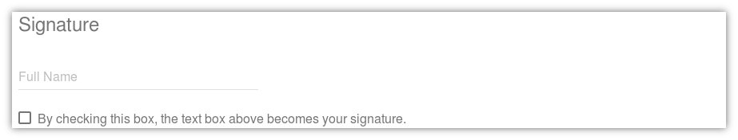

The signature field includes a box for a user to type their name or
signature, and a box which when clicked satisfies the conditions in
the United States for a signature.  Before using this system for cases
where a signature needs to be legally binding, you should consult with
legal council and determine if this is sufficient for your region and
local laws.
